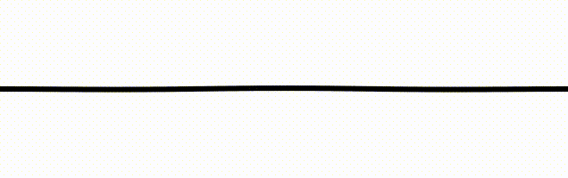
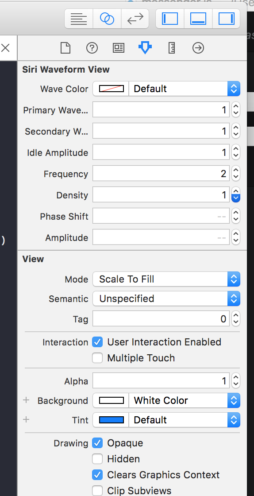

# SineWaveform

A UIView subclass that reproduces a waveform effect.




### Storyboard or XIB


### Programmatic

```
import SineWaveformView

var waveView: SineWaveformView()

# in your view controller append the view etc...
```

## Usage

Install via cocoapods

```
pod install SineWaveform
```
