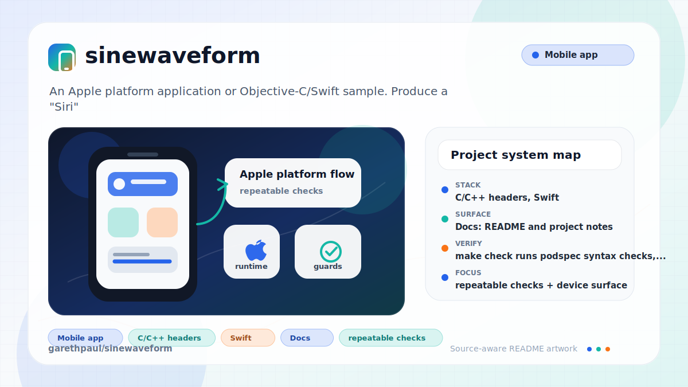
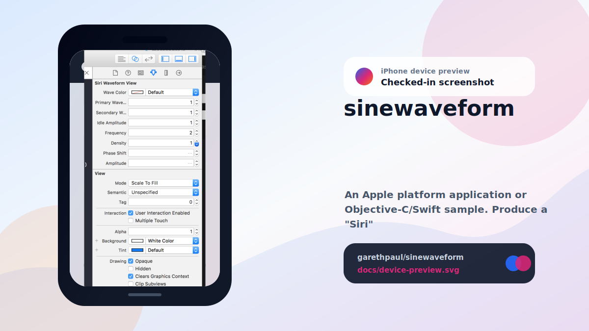

# sinewaveform

<!-- README-OVERVIEW-IMAGE -->


## Device Preview

<!-- DEVICE-PREVIEW-IMAGE -->


## Overview

`garethpaul/sinewaveform` is a reusable Swift view that renders a Siri-style animated waveform for Apple platforms.

This README is based on the checked-in source, manifests, scripts, and repository metadata on the `master` branch. The project language mix found during review was: C/C++ headers (1), Swift (1).

## Repository Contents

- `README.md` - project overview and local usage notes
- `CHANGES.md` - maintenance history for package and waveform checks
- `Makefile` - local verification entry points
- `docs/plans` - completed maintenance plans for the current baseline
- `plans` - historical implementation notes
- `scripts` - static package and waveform validators
- `SECURITY.md` - security reporting and disclosure guidance
- `SineWaveform` - source or example code
- `SineWaveform.xcodeproj` - Xcode project file
- `VISION.md` - project direction and maintenance guardrails

Additional scan context:

- Source directories: SineWaveform
- Dependency and build manifests: SineWaveform.podspec
- Entry points or build surfaces: SineWaveform.xcodeproj
- Test-looking files: no obvious test files detected

## Getting Started

### Prerequisites

- Git
- macOS with Xcode for building Apple platform projects
- Python 3 and Ruby for repository source checks

### Setup

```bash
git clone https://github.com/garethpaul/sinewaveform.git
cd sinewaveform
```

The setup commands above are derived from repository files. Legacy mobile, Python, or JavaScript samples may require older SDKs or package versions than a modern workstation uses by default.

## Running or Using the Project

- Open `SineWaveform.xcodeproj` in Xcode, choose the app or sample scheme, and run it on the matching simulator/device.
- For CocoaPods package checks, start from the root `SineWaveform.podspec`.

## Testing and Verification

- `make check` runs podspec syntax checks, static package metadata checks, and
  waveform drawing safety checks for context availability, finite positive
  bounds, wave count, and draw step handling. When `xcodebuild` is installed,
  the `build` target also builds the `SineWaveform` target for the iOS simulator.
- Static waveform checks also require caller-provided levels and idle amplitude
  values to be clamped into the expected `0...1` drawing range.
- Static waveform checks also require level and idle-amplitude normalization to
  reject `NaN` before updating the draw amplitude.
- Static waveform checks also require draw-time maximum amplitude to stay
  nonnegative for very short view bounds.
- Static waveform checks also require inspectable line widths to be clamped
  before they are passed to Core Graphics.
- Static waveform checks also require draw-time wave counts to be capped so
  excessive inspectable values cannot make a draw pass unbounded.
- Static waveform checks also require phase accumulation to be wrapped to a
  single sine cycle on each level update.
- Static waveform checks also require negative phase remainders to be shifted
  into the nonnegative cycle.
- Static waveform checks also require frequency, density, line widths, and
  phase shift to pass through shared finite-range normalization before drawing;
  negative frequency remains supported for mirrored waveforms.
- Static waveform checks also require the final horizontal sample to be
  clamped to the right view edge so draw geometry never extends past bounds.
- Static waveform checks reject non-finite view dimensions before Core Graphics
  mutations, division, or horizontal sampling.
- Static package checks cover the root and archived versioned podspec metadata.
- Static package checks require the publishable root podspec to declare Swift 5
  and the same iOS 12 minimum as the hosted Xcode build; archived release
  podspec snapshots retain their historical compatibility metadata.
- Static package checks reject empty placeholder podspec descriptions before
  the real package description.
- Static package checks also require completed canonical plans under `docs/plans`.
- GitHub Actions runs portable package and waveform checks on Ubuntu 24.04 and
  builds the framework for a generic iOS Simulator on macOS 15.
- The single approved workflow uses immutable actions, read-only permissions,
  and checkout with persisted GitHub credentials disabled in both jobs.
- The Xcode project uses Swift 5 language mode and targets iOS 12 or newer.
- Xcode's test action or `xcodebuild test` with the appropriate scheme and
  destination can be used on macOS for deeper verification.

When the required SDK or runtime is unavailable, use static checks and source review first, then verify on a machine that has the matching platform toolchain.

## Configuration and Secrets

- No required secret or credential file was identified in the repository scan. If you add integrations later, keep secrets out of git.

## Security and Privacy Notes

- Review changes touching network requests, sockets, or service endpoints; examples from the scan include SineWaveform/Info.plist.
- Review changes touching file, media, JSON, XML, CSV, OCR, or data parsing; examples from the scan include SineWaveform/Info.plist.

## Maintenance Notes

- This looks like an Apple platform project or sample. Xcode, Swift, CocoaPods, and deployment target versions may need to match the original project era.
- See `SECURITY.md` for vulnerability reporting and safe research guidance.
- See `VISION.md` for project direction and contribution guardrails.
- See `docs/plans/2026-06-08-sinewaveform-baseline.md` for the canonical
  package and drawing safety baseline.
- See `docs/plans/2026-06-08-versioned-podspec-metadata.md` for the archived
  podspec metadata guard.
- See `docs/plans/2026-06-08-podspec-description-guard.md` for the podspec
  description metadata guard.
- See `docs/plans/2026-06-09-amplitude-clamp.md` for the waveform amplitude
  input guard.
- See `docs/plans/2026-06-09-nan-safe-unit-normalization.md` for the NaN-safe
  level and idle-amplitude normalization guard.
- See `docs/plans/2026-06-09-nonnegative-draw-amplitude.md` for the short-bounds
  draw amplitude guard.
- See `docs/plans/2026-06-09-line-width-clamp.md` for the inspectable stroke
  width guard.
- See `docs/plans/2026-06-09-maximum-wave-count.md` for the draw-time maximum
  wave-count guard.
- See `docs/plans/2026-06-09-phase-accumulator-bound.md` for the bounded phase
  accumulator guard.
- See `docs/plans/2026-06-09-nonnegative-phase-normalization.md` for
  nonnegative phase normalization.
- See `docs/plans/2026-06-10-finite-inspectable-inputs-and-ci.md` for bounded
  inspectable floating-point inputs and the CI gate.
- See `docs/plans/2026-06-10-right-edge-sample-clamp.md` for bounded
  right-edge waveform sampling.
- See `docs/plans/2026-06-12-root-podspec-toolchain-alignment.md` for the
  publishable CocoaPods/Xcode compatibility contract.

## Contributing

Keep changes small and tied to the project that is already present in this repository. For code changes, document the toolchain used, avoid committing generated dependency directories or local configuration, and update this README when setup or verification steps change.
